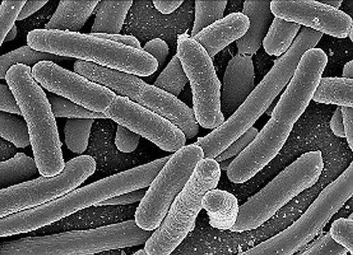
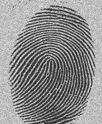
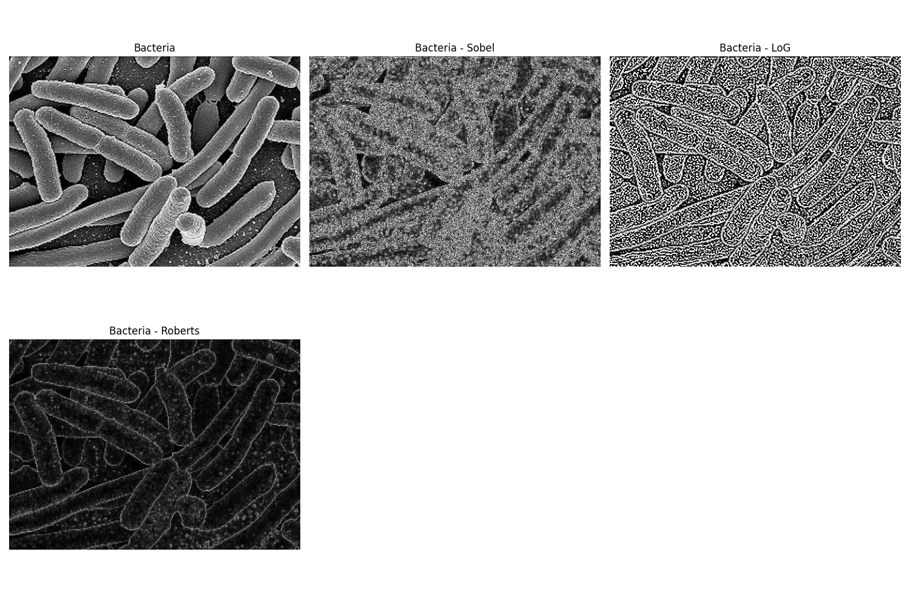
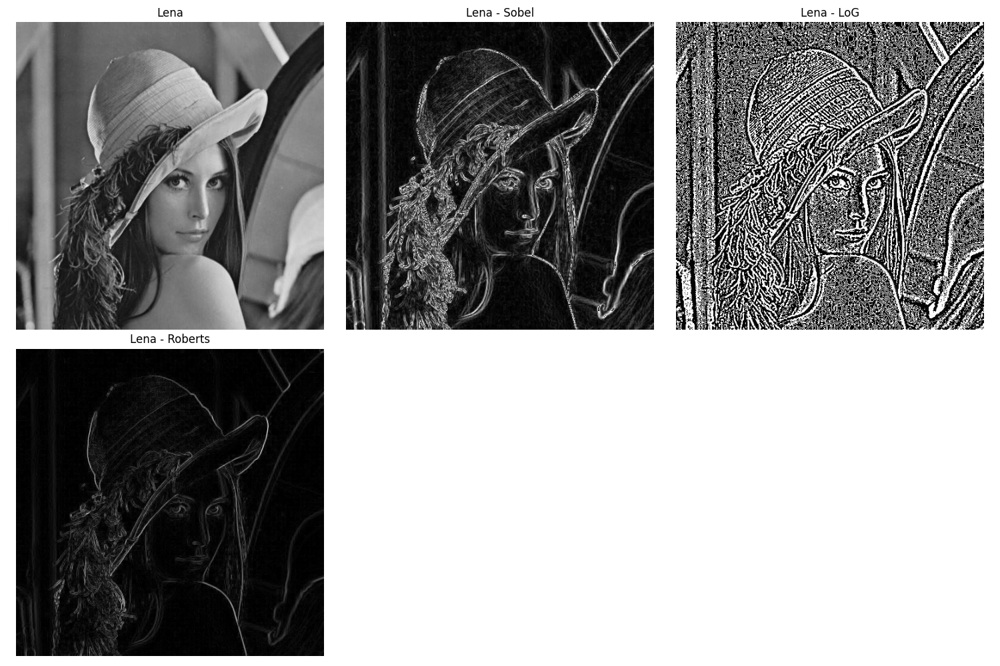
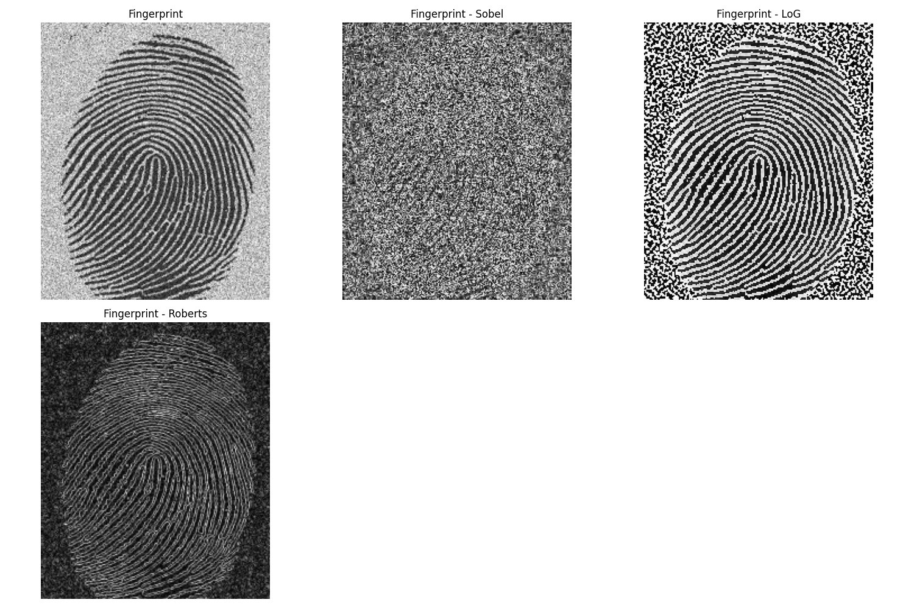
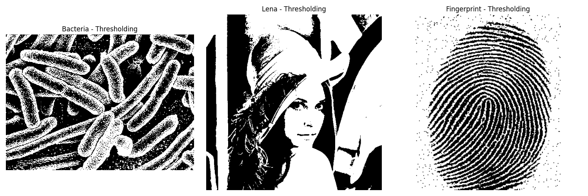

# Thresholding and Image Segmentation

This project demonstrates various image processing techniques including edge detection and thresholding using Python and OpenCV.

## Table of Contents

- [Introduction](#introduction)
- [Dependencies](#dependencies)
- [Installation](#installation)
- [Usage](#usage)
- [Classes and Functions](#classes-and-functions)
  - [ImageProcessing Class](#imageprocessing-class)
  - [plot_images Function](#plot_images-function)
- [Experimental Images](#experimental-images)
- [Output Results](#output-results)
- [Contributing](#contributing)
- [License](#license)

## Introduction

This project applies different edge detection algorithms and thresholding techniques on sample images. The edge detection methods include Sobel, Laplacian of Gaussian (LoG), and Roberts. The thresholding method uses Otsu's global thresholding.

## Dependencies

- Python 3.x
- OpenCV
- NumPy
- Matplotlib

## Installation

Clone the repository and install the required dependencies:

```bash
git clone https://github.com/Hetawk/thresholding_and_image_segmentation.git
cd thresholding_and_image_segmentation
pip install -r requirements.txt
```

## Usage

To run the project, execute the main script:

```bash
python main.py
```
This will process the images located in the `data` directory and save the results in the `output` directory.

## Classes and Functions

### ImageProcessing Class

- **Purpose**: Handles various image processing tasks, including edge detection and thresholding.
- **Functions**:
  - `__init__(self, image_path)`: Initializes the class with an image loaded from the given path.
  - `sobel_edge_detection(self, ksize=3)`: Applies Sobel edge detection with a specified kernel size.
  - `log_edge_detection(self, sigma=1.0)`: Applies Laplacian of Gaussian (LoG) edge detection with a specified sigma.
  - `roberts_edge_detection(self)`: Applies Roberts edge detection using 2x2 convolution kernels.
  - `global_thresholding(self)`: Applies global thresholding using Otsu's method to binarize the image.

### plot_images Function

- **Purpose**: Plots and saves a list of images with corresponding titles.
- **Parameters**:
  - `images`: List of images to plot.
  - `titles`: List of titles for the images.
  - `output_dir`: Directory to save the plotted images.
  - `cols`: Number of columns in the plot grid (default is 3).
- **Features**:
  - Creates output directory if it doesn't exist.
  - Arranges images in a grid format.
  - Saves each image with its title in the specified directory.
  - Displays the plot with a tight layout.

## Experimental Images

Here are the sample images used for the experiment:

- **Bacteria**
  

- **Lena**
  

- **Fingerprint**
  

## Output Results

The processed images are saved in the `output` directory. Below are examples of the output results:

### Bacteria

- **Sobel Edge Detection, LoG Edge Detection, and Roberts Edge Detection are applied on the Bacteria image**
  


### Lena

- **Sobel Edge Detection, LoG Edge Detection, and Roberts Edge Detection are applied on the Lena image**
  


### Fingerprint

- **Sobel Edge Detection, LoG Edge Detection, and Roberts Edge Detection are applied on the Fingerprint image**
  

### Thresholding

- **Sobel Edge Detection, LoG Edge Detection, and Roberts Edge Detection are applied on the experimental images**
  

## Contributing

Contributions are welcome! Please open an issue or submit a pull request for any changes or improvements.

## License

This project is licensed under the MIT License. See the [LICENSE](LICENSE) file for details.

